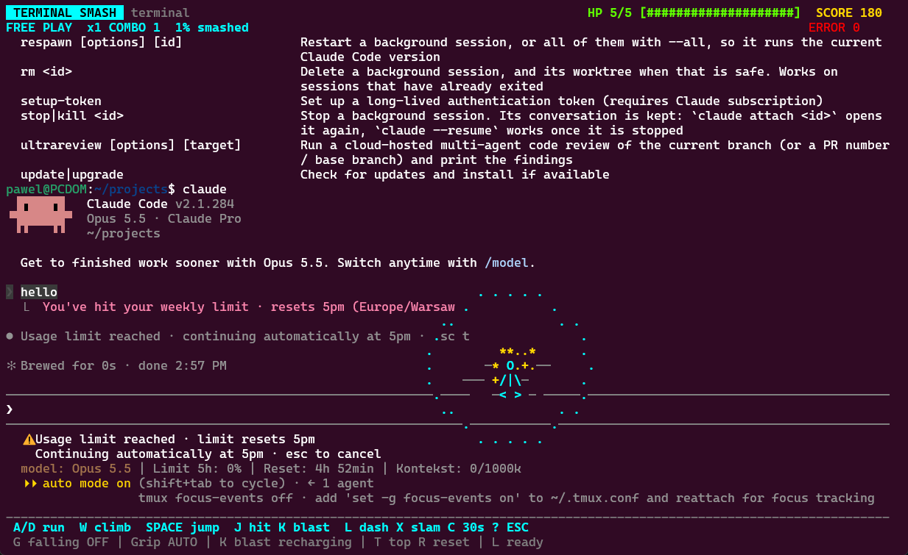
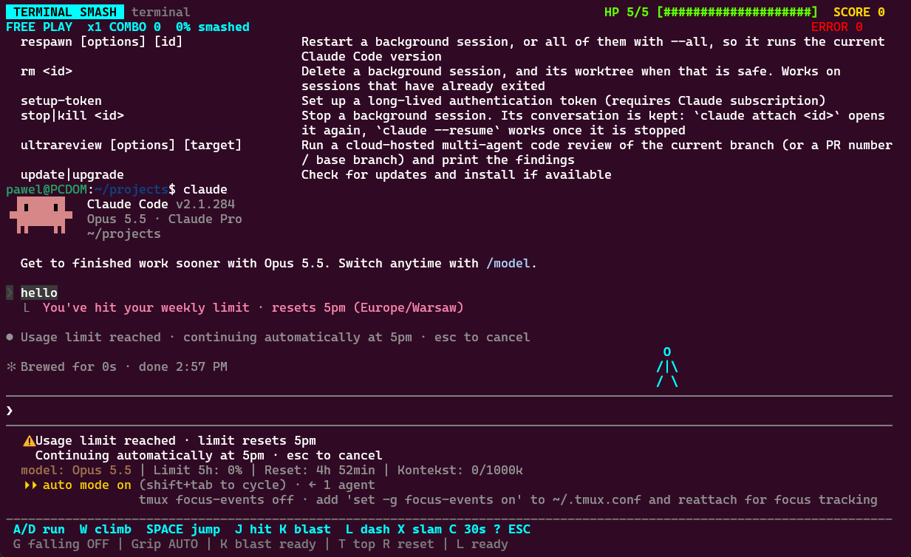
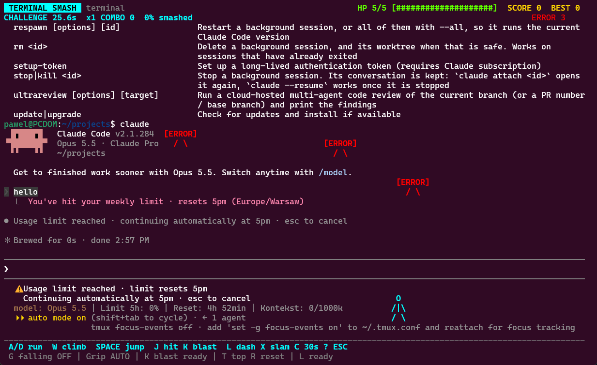

# Terminal Smash

An ASCII game inside your terminal. Run, jump and smash a copy of your terminal's text, or play the built-in demo. Your actual shell and running programs are unaffected.



<details>
<summary>More screenshots</summary>

**Free play on a captured terminal session**



**Challenge mode with ERROR enemies**



</details>

## Install

Requires Linux or WSL, Python 3.10+ with `curses`, and a terminal at least 44×14 characters. Capturing your terminal also requires tmux 3.4+; the demo works without tmux.

Download or clone this repository, then open its directory:

```bash
# Ubuntu / WSL dependencies
sudo apt install python3 tmux

./install.sh
terminal-smash --demo
```

No pip packages are needed. The installer uses `~/.local`, adds tmux shortcuts and backs up your tmux configuration before changing it. If the command is not found, use `~/.local/bin/terminal-smash` or add `~/.local/bin` to your `PATH`.

### Best experience: recommended terminals

For the smoothest controls, use a terminal that reports both key presses and releases through the [Kitty Keyboard Protocol](https://sw.kovidgoyal.net/kitty/keyboard-protocol/). Movement stays continuous while you hold a key, without waiting for the system's first key repeat, and releasing stops grounded movement promptly.

| Terminal | Compatibility |
| --- | --- |
| **Windows Terminal Preview 1.25 + Ubuntu/WSL** | **Tested with the game** using Preview 1.25.1912.0. Preview is a separate app from stable Windows Terminal; in Polish Windows it appears as **Podgląd terminalu**. |
| **Kitty, Ghostty, Foot** | Implement the protocol; expected to support precise controls, but not yet tested with the game. See the [protocol's implementation list](https://sw.kovidgoyal.net/kitty/keyboard-protocol/). |
| **Alacritty 0.13+** | Added protocol support in [0.13.0](https://github.com/alacritty/alacritty/releases/tag/v0.13.0); not yet tested with the game. |
| **WezTerm** | Enable [`enable_kitty_keyboard = true`](https://wezterm.org/config/lua/config/enable_kitty_keyboard.html); not yet tested with the game. |

Support depends on the terminal version and configuration. Run `terminal-smash --keyboard-check` **outside tmux/screen** and look for `Press/release reporting enabled`, followed by a `release` event when you let go of an arrow.

Use **Ctrl+b, then Shift+s** for Smash or **Shift+t** for Tower. Both shortcuts, as well as `terminal-smash`, `terminal-smash --challenge` and `terminal-smash --tower`, use direct terminal input by default. The legacy `--popup` path and terminals without confirmed support still work, but may pause before the first key repeat.

## Play

```bash
terminal-smash --demo          # Built-in playground
terminal-smash --session       # Open a tmux session
terminal-smash --file log.txt  # Play with a text file
terminal-smash --tower         # Climb the retained history of your tmux pane
terminal-smash --demo --tower  # Try a complete tower without tmux
```

Inside tmux, press **Ctrl+b**, release it, then press **Shift+s** to play with the visible text or **Shift+t** to open Tower with the pane's full retained history. Press **Esc** to return to your shell. With a custom tmux prefix, use it instead of Ctrl+b.

When playing a captured tmux pane, all modes temporarily detach only the client that launched them and run directly in that terminal. Esc reconnects it to the same tmux session; the session and its programs keep running. This lets a compatible terminal send key releases to the game for smooth movement and precise taps. Add `--popup` to use the original tmux popup instead. When several clients show the same pane, use the shortcut in the intended client or supply its exact `--client` name.

Direct launch refuses to detach if tmux is configured to destroy unattached sessions or exit when unattached. Use `--popup` with those configurations.

**Gravity is OFF by default:** untouched letters stay in place. Press **G** to change it and restart the scene, or launch with `--gravity on`.

Press **C** for a 30-second challenge with respawning `ERROR` enemies and local high scores. You have **5 HP**; enemy contact costs one. The round ends when time or health runs out. You can also start with `terminal-smash --challenge` inside tmux, or `terminal-smash --demo --challenge`.

### Scrollback Tower

Press **Ctrl+b**, then **Shift+t**, or run `terminal-smash --tower` inside tmux to climb from the newest output to the oldest retained line. The game takes a snapshot of the pane's scrollback before opening; your shell keeps running. History that tmux has already discarded cannot be recovered. Snapshots are limited to 2 MiB, and an oversized history produces an error instead of silently shortening the tower.

Bright, underlined fragments of your actual output are solid from above; dim text stays in the background. The route picks reachable text with varied spacing and horizontal positions. Footholds start broad and narrow toward the summit, within the original text available. Their width depends on how high you climb, not on elapsed time. Every 12 foothold levels brings a new colour; the oldest highlighted fragment stays gold. Artificial bridges appear only where the text leaves an otherwise unreachable gap. Empty output shows a message instead of creating a tower.

Use **A/D** or the arrow keys to steer, **Space/W/↑** to jump twice, and **S/↓** to drop through a platform. Jumps cover larger gaps and falling is faster than rising. You start on a full-width green **SAFE FLOOR** at the base of the tower. It catches early missed jumps, and dropping cannot pass through it. Once the floor scrolls out of view, the camera starts chasing you upward: the text moves down even while you stand still. The chase begins slowly and accelerates over time. Keep climbing to stay above the bottom of the screen; falling below it ends the attempt. Your time, climbed rows and jump count appear at the finish.

The chase adapts to the window height and slows while you cross unusually wide footholds. Jump routes leave room for the camera to move during landing. Help and a clipped or undersized window pause the chase along with the game.

With a compatible terminal, A/D and the arrows move for as long as you hold them, including the interval before the first keyboard repeat. Releasing stops grounded movement immediately; airborne momentum is preserved. If two directions are held, the most recently pressed wins, and releasing it returns to the other direction. Losing focus clears held keys and opens help to pause the game; press **?** after returning to resume.

Precise movement requires the terminal to confirm the [Kitty Keyboard Protocol](https://sw.kovidgoyal.net/kitty/keyboard-protocol/) with press/repeat/release and all-key reporting. On Windows, [Windows Terminal Preview 1.25](https://devblogs.microsoft.com/commandline/windows-terminal-preview-1-25-release/) adds this protocol; stable 1.24 does not provide it. No keyboard-repeat settings need to change. The game detects support at launch and restores terminal modes on exit.

To check your terminal, run this **outside tmux/screen**:

```bash
terminal-smash --keyboard-check
```

Hold an arrow, release it, then tap it. The check should show `Press/release reporting enabled`, keep the arrow in `DOWN` while held, and show a `release` event when let go. Esc exits. The check does not save key history. Demo/file games launched outside tmux also negotiate this input automatically.

On terminals without confirmed support, or inside a legacy popup, the game falls back to short 60 ms steps and 60–120 ms repeat windows. The initial system-repeat pause remains in this fallback. A tmux upgrade or `extended-keys` setting alone does not establish key-release support; use the direct launch path.

**R** retries the same route from the bottom and **?** pauses the game and timer. A new launch chooses a new route. Resizing preserves your attempt; if narrowing the window clips text needed by the route, the game pauses until you widen it. Wall grips, attacks, falling text and the top teleport are disabled in Tower. **V** switches between Tower and free play; **C** enters challenge mode. Switching modes starts a new attempt. The V shortcut uses the text already loaded; launch with `--tower` to capture the full tmux history rather than only the visible screen.

Use `terminal-smash --file log.txt --tower` for a saved log, or `terminal-smash --demo --tower` for a finite demo history. Tower and `--challenge` cannot be combined; Tower uses fixed platforms and does not accept `--gravity on`.

## Controls

| Key | Action |
| --- | --- |
| A / D or ← / → | Move |
| Space | Jump twice; release a wall or ceiling |
| W / ↑ | Jump, or climb up a wall |
| S / ↓ | Drop through text, climb down, or release the ceiling |
| J / K | Punch / smash |
| L / X | Dash / downward slam |
| G | Toggle text gravity and restart |
| C / R | Switch challenge mode / restart |
| V | Switch Tower / free play using the loaded text |
| T / Home | Return to the top |
| ? | Help and pause |
| Esc / Q | Exit |

Walls and the ceiling are grabbed automatically. Climb a side wall, move along the ceiling with A/D, then drop onto an otherwise unreachable platform. Attacks affect a small area; falling text does not trigger extra explosions.

## Update, remove, or check

Run these from the repository directory:

```bash
./install.sh                      # Install the current version again
./install.sh --uninstall          # Keep modified files and config backups
./terminal-smash --doctor         # Check requirements
python3 -m unittest discover -s tests -q
```
